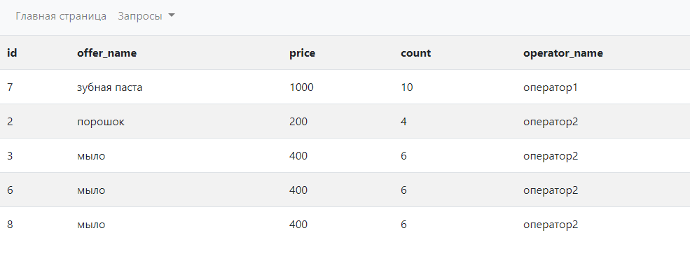
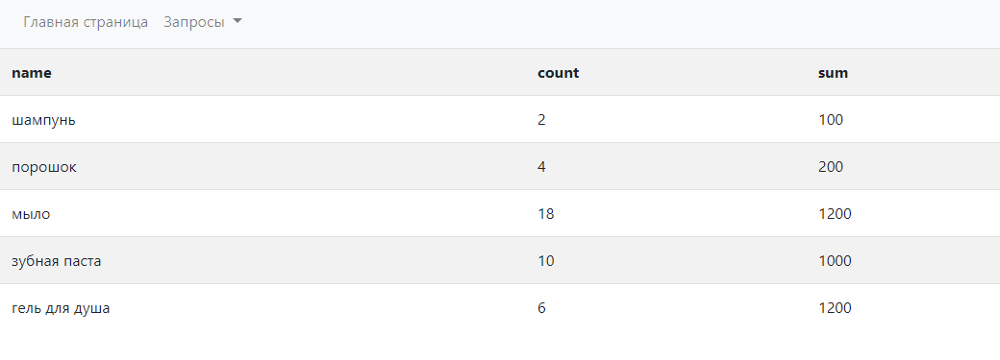

# Test
>Реализуется архитектува по принципу MVC
- controllers - В этой папке хранятся контроллеры. Используются для оброботки даних пользователя и БД.
- db - Здесь хранится класс подключения к БД и файл конфигувации БД. 
- js - Здесь находяться файли JavaScript
- models - В этой папке хранятся модели. Используются для роботи с БД. 
- views - В этой папке хранятся представления. Используются для представления даних на странице.
- autoload.php - Класс для пожключения классов.
- index.php - Точка входа в приложение.
- init.php - Инициализирующий класс.
- router.php - Класс для парсинга url.
>Ход работи приложения
1. В index.php подключается (autoload.php, init.php). Запускается метод run класса Init и передается текущий url
2. Далие подключается класс Router которий розбивает url в такой формат controller/action/param1/param2/...
3. Далие обьявляется класс контроллера и запускается нужный метод.
4. В методах контроллера обьявляются нужные модели.
5. Далие в контроллере фовмируются дание для представления.
6. В классе Init обьявляется представление  
>Инструкция по запуску
1. В файле db/db_config.php прописать конфиги для БД.
2. Запустить dump БД в db/testworktrafgid.sql.
>Зпросы к бд 

Номер заказа, имя товара, цена, количество, имя оператора за которым числится заказ ,ГДЕ количество товара >2 И id оператора 10 ИЛИ 12
``` SQL 
SELECT requests.id, offers.name as offer_name, requests.price, requests.count, operators.name as operator_name 
FROM requests
JOIN offers on offers.id = requests.offer_id
JOIN operators on operators.id = requests.operator_id
WHERE ( requests.count > 2 ) AND (operators.id = 10 OR operators.id = 12)
```

Имя товара, количество товара, и сумма (price) по каждому товару (сгруппировать)
``` SQL
SELECT offers.name, SUM(requests.count) as count, SUM(requests.price) as sum 
FROM requests
JOIN offers on offers.id = requests.offer_id
GROUP BY requests.offer_id   
```

